# AI-Driven Development Pipeline

A general-purpose development flow for teams using Claude Code (or any AI coding assistant).
Applies to any repository or project. The goal is a quality floor: even the worst-case
delivery clears a minimum acceptable bar before it reaches production.

---

## Flow

```mermaid
flowchart LR
    classDef human     fill:#fef3c7,stroke:#d97706,color:#92400e,rx:6
    classDef agentCtrl fill:#ede9fe,stroke:#7c3aed,color:#4c1d95,rx:6
    classDef automated fill:#dbeafe,stroke:#2563eb,color:#1e3a8a,rx:6

    S1["**1. Create Task**
    Lead / PM
    User story + micro-tasks"]:::human

    S2["**2. Create Spec**
    Developer triggers / Claude Code
    Patterns & decisions → GitHub Issue"]:::agentCtrl

    S3["**3. Review Spec**
    Lead / Reviewer
    Approve before coding"]:::human

    S4["**4. Implement**
    Developer + Claude Code
    TDD — tests first"]:::agentCtrl

    S5["**5. Local AI Review**
    Developer triggers / Claude Code
    Validate issues vs spec"]:::agentCtrl

    S6["**6. Record Video**
    Developer
    Smoke/regression + screenshot"]:::human

    S7["**7. Submit PR**
    Developer triggers / Claude Code
    Code + video + screenshot"]:::agentCtrl

    S8["**8. AI Code Review**
    CI / Claude Code
    Auto on PR open"]:::automated

    S9["**9. Sign-off**
    Lead / Reviewer
    Verify vs spec; merge"]:::human

    S1 --> S2 --> S3 --> S4 --> S5 --> S6 --> S7 --> S8 --> S9
```



**Legend:** 🟡 Human — 🟣 Human triggers, AI executes — 🔵 Fully automated

---

## Stage Descriptions

**1. Create Task** 🟡 Human
The lead or PM writes a user story and breaks it into micro-tasks. Each micro-task must
have a clear description and specific acceptance criteria. Tasks live in GitHub Issues and
are linked to the parent story so the full chain is traceable.

**2. Create Spec** 🟣 Agent-controlled
Before writing any code, the developer prompts the AI to generate an implementation plan
for the task. The plan covers which patterns to use, why they fit the context, and any
relevant design decisions. It is stored permanently in the GitHub Issue — not discarded
after use — so there is always a record of how the implementation was designed.

**3. Review Spec** 🟡 Human
A lead or designated reviewer reads the spec before implementation starts. They check that
the right patterns are proposed, nothing critical is missing, and the plan aligns with the
acceptance criteria. The developer cannot begin coding until the spec is approved.

**4. Implement** 🟣 Agent-controlled
The developer implements following the approved spec using Test-Driven Development: tests
are written first, then the code to pass them. All services must be run locally and verified
to start and communicate correctly. Fixing one file must not silently break another.

**5. Local AI Review** 🟣 Agent-controlled
Before opening the PR, the developer runs the AI code-review command locally. The output
is a list of issues found by the AI. The developer reads each one and validates it against
the spec and business logic — not every flagged item is necessarily valid. Legitimate issues
are fixed before the PR is opened.

**6. Record Video** 🟡 Human
The developer records a short screen capture showing the feature or fix running end-to-end.
For small changes a smoke test (happy path) is enough. For larger or riskier changes, full
regression coverage should be demonstrated. A screenshot of the local test run is also
captured. This is proof that the developer tested what they built.

**7. Submit PR** 🟣 Agent-controlled
The developer uses the AI to prepare and open the PR, which must include the code changes,
the walkthrough video, and the test run screenshot. The PR description references the
GitHub Issue so the full chain is traceable: issue → spec → implementation → PR.
The developer is 100% responsible for the code — AI is an accelerator, not an excuse.

**8. AI Code Review** 🔵 Automated
The AI code-review command runs automatically on every new PR via CI. It posts review
comments directly on the PR without any human trigger. Once all AI-flagged issues are
resolved, a human reviewer steps in. This stage acts as the last automated quality gate
before human eyes.

**9. Sign-off** 🟡 Human
The reviewer verifies that the delivered code matches the approved spec and satisfies the
acceptance criteria from Stage 1. They confirm the video and test screenshot are present
and credible, then merge or request changes.

---

## Quality Layers

Each stage is a filter. Defects that slip through one layer are caught by the next.

```
TDD  →  Local AI Review  →  Video QA  →  Automated CI Review  →  Human Sign-off
```

By the time a bug escapes all five layers it should be an edge case, not a systematic failure.
The developer owns the code. The AI tools own nothing.
