# Pipeline Diagrams

Full stage descriptions: `docs/dev-flow.md`.

---

## Diagram A — Team Development Pipeline

```mermaid
flowchart LR
    classDef human     fill:#fef3c7,stroke:#d97706,color:#92400e,rx:6
    classDef agentCtrl fill:#ede9fe,stroke:#7c3aed,color:#4c1d95,rx:6
    classDef automated fill:#dbeafe,stroke:#2563eb,color:#1e3a8a,rx:6

    S1["**1. Create Task**
    Lead / PM
    User story + micro-tasks"]:::human

    S2["**2. Create Spec**
    Developer triggers / Claude Code
    Patterns & decisions → GitHub Issue"]:::agentCtrl

    S3["**3. Review Spec**
    Lead / Reviewer
    Approve before coding"]:::human

    S4["**4. Implement**
    Developer + Claude Code
    TDD — tests first"]:::agentCtrl

    S5["**5. Local AI Review**
    Developer triggers / Claude Code
    Validate issues vs spec"]:::agentCtrl

    S6["**6. Record Video**
    Developer
    Smoke/regression + screenshot"]:::human

    S7["**7. Submit PR**
    Developer triggers / Claude Code
    Code + video + screenshot"]:::agentCtrl

    S8["**8. AI Code Review**
    CI / Claude Code
    Auto on PR open"]:::automated

    S9["**9. Sign-off**
    Lead / Reviewer
    Verify vs spec; merge"]:::human

    S1 --> S2 --> S3 --> S4 --> S5 --> S6 --> S7 --> S8 --> S9
```

| # | Stage | Actor | Type |
|---|---|---|---|
| 1 | Create Task | Lead / PM | 🟡 Human |
| 2 | Create Spec | Developer + Claude Code | 🟣 Agent-controlled |
| 3 | Review Spec | Lead / Reviewer | 🟡 Human |
| 4 | Implement (TDD) | Developer + Claude Code | 🟣 Agent-controlled |
| 5 | Local AI Review | Developer + Claude Code | 🟣 Agent-controlled |
| 6 | Record Video | Developer | 🟡 Human |
| 7 | Submit PR | Developer + Claude Code | 🟣 Agent-controlled |
| 8 | AI Code Review | CI / Claude Code | 🔵 Automated |
| 9 | Sign-off | Lead / Reviewer | 🟡 Human |

---

## Diagram B — Pipeline with Versioned Specs

Same flow. S2 stores the spec as a versioned file committed to the repo
(`docs/exec-plans/active/spec-N.md`) instead of the GitHub Issue body,
so plans are permanent and traceable across branches.

```mermaid
flowchart LR
    classDef human     fill:#fef3c7,stroke:#d97706,color:#92400e,rx:6
    classDef agentCtrl fill:#ede9fe,stroke:#7c3aed,color:#4c1d95,rx:6
    classDef automated fill:#dbeafe,stroke:#2563eb,color:#1e3a8a,rx:6

    S1["**1. Create Task**
    Lead / PM
    User story + micro-tasks"]:::human

    S2["**2. Create Spec**
    Developer triggers / Claude Code
    docs/exec-plans/active/spec-N.md"]:::agentCtrl

    S3["**3. Review Spec**
    Lead / Reviewer
    Approve before coding"]:::human

    S4["**4. Implement**
    Developer + Claude Code
    TDD — tests first"]:::agentCtrl

    S5["**5. Local AI Review**
    Developer triggers / Claude Code
    Validate issues vs spec"]:::agentCtrl

    S6["**6. Record Video**
    Developer
    Smoke/regression + screenshot"]:::human

    S7["**7. Submit PR**
    Developer triggers / Claude Code
    Code + video + screenshot"]:::agentCtrl

    S8["**8. AI Code Review**
    CI / Claude Code
    Auto on PR open"]:::automated

    S9["**9. Sign-off**
    Lead / Reviewer
    Verify vs spec; merge"]:::human

    S1 --> S2 --> S3 --> S4 --> S5 --> S6 --> S7 --> S8 --> S9
```

| Stage | Diagram A | Diagram B |
|---|---|---|
| 2 — Create Spec | Stored in GitHub Issue task body | Versioned `docs/exec-plans/active/spec-N.md`, committed to repo |
